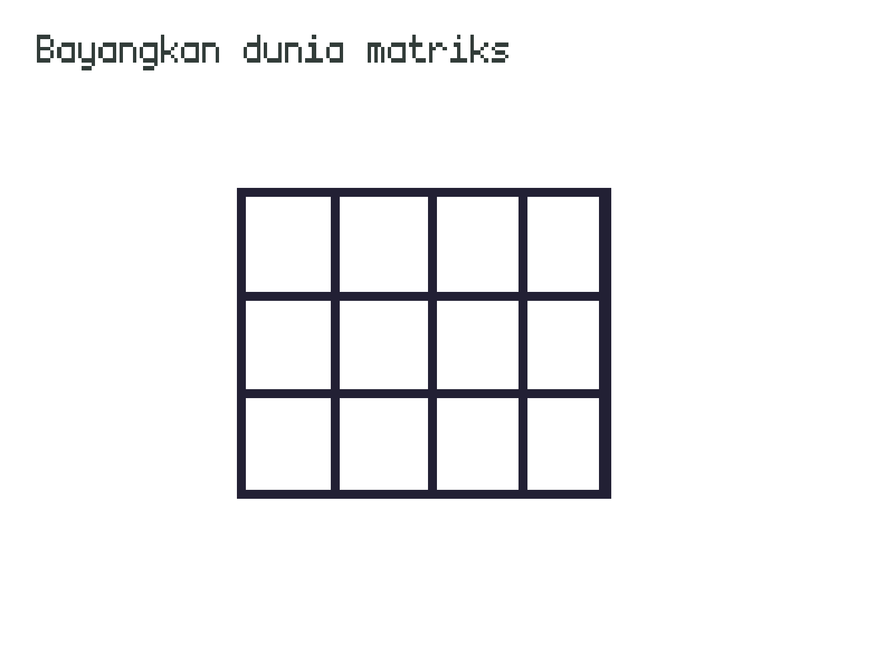

# Konsep-konsep Mekanik Game

Game engine menjadi alat untuk mensimulasi sebuah dunia dalam komputer, tepatnya dunia permainan. 
Mekanika yang digunakan untuk mengatur isi dunia disana menggunakan sistem matrik, koordinat kartesian.



Bicara mengenai penyusun materi dunia akan lebih afdol bila kita mengulas sedikit filsafat tentangnya, 
teori atom. Filsuf Yunani Kuno Demokritus mengemukakan bahwa dunia tersusun dari ruang hampa dan atom yang
berbeda-beda (ada yang bulat, bergerigi dan semacanya) yang membentuk benda tampak yang kita temui seperti pohon,
manusia dan batu di permukaan bulan.

## Sprite

Demikian pula pada dunia game, disana semua objek seperti player, item, musuh bahkan terrain terbentuk dari sprite,
bisa kita sepakati bahwa sprite adalah "atom" untuk dunia game. Sprite adalah gambar yang memiliki logika untuk
berinteraksi dengan dunianya, dan kita sebagai developer menyusun dunia ini untuk memiliki mekaniknya sendiri. 

Kamu bisa membuat sprite di Haxeflixel dengan meng-nurunkan kelas `FlxSprite` kemudian memuat asset gambar dan memberi
semantik seperti bergerak ketika tombol keyboard ditekan atau sprite hilang bila player mati terkena ranjau. 

```javascript
class Player extends {
    final SPEED : Int =300;

    public function new(posX: Int,posY: Int)
    {
        x = posX;
        y = posY;
        makeGraphic(32,32,Color.WHITE);
    }

    override public function update(){
        // Melacak tombol keyboard yang ditekan.
        const isLeftPressed = isAnyKeysPressed([LEFT,A]);
        const isRightPressed = isAnyKeysPressed([RIGHT,D]);
        const isUpPressed = isAnyKeysPressed([UP,W]);
        const isDownPressed = isAnyKeysPressed([DOWN,S]);

        // Memberikan aksi berdasarkan kondisi
        // tombol yang ditekan.
        if(isLeftPressed && isRightPressed){
            velocity.x = 0;
        }else if(isLeftPressed) {
            velocity.x = -SPEED;
        }else if(isRightPressed) {
            velocity.x = SPEED;
        } else {
            velocity.x = 0;
        }

        if(isUpPressed && isDownPressed){
            velocity.y = 0;
        }else if(isUpPressed) {
            velocity.y = -SPEED;
        }else if(isDownPressed) {
            velocity.y = SPEED;
        } else {
            velocity.y = 0;
        }
    }
}
```

## State

Jika *sprite* adalah atom, maka *state* adalah ruang hampa / matrik. *State* adalah ruang matriks yang buat oleh game engine dan
 bertugas menjadi arena permainan (*gameplay*) yang berisi kumpulan *sprite*, seperti terain, player, enemey dan juga mengatur 
 aspek kondisi permainan seperti kamera, level dan status permainan. 

Bila dianalogikan, state panggung sandiwara antar sprite-sprite dan pengguna yang dibawahnya sudah diberi tanda apa yang harus dilakukan. 
Sprite didalam state diposisikan seperti koordinat matriks menggunakan x dan y dalam state lalu state akan memanggil fungsi update dari 
semua sprite untuk menyocokan posisi, bila kamu pernah mendengar kata FPS (*Frame-per-second*) itu adalah berapa banyak fungsi update 
dipanggil dari sprite.

## Rule

Kondisi permainan memiliki banyak aspek mulai dari hukum interaksi antar sprite, status permainan berdasarkan mekanik yang dirancang dan
penyusunan level yang dikehendaki.

### Status permainan

// TBD

### Fisika

// TBD
